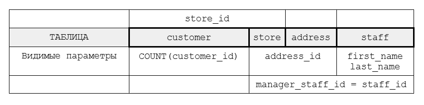
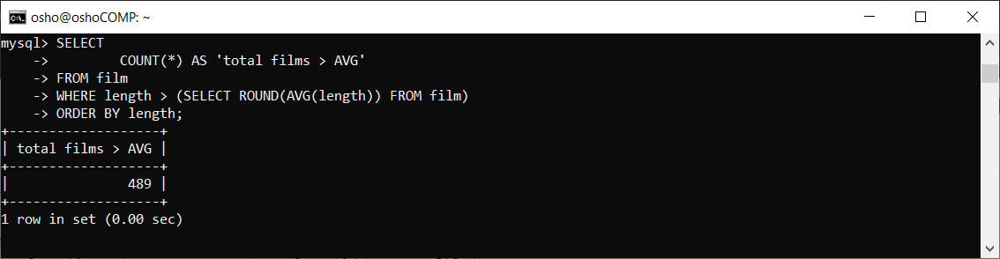
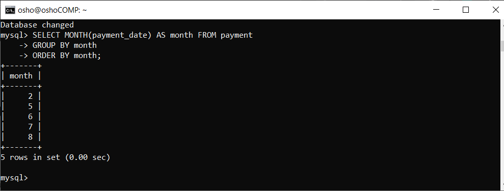
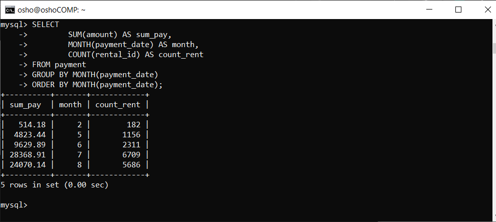
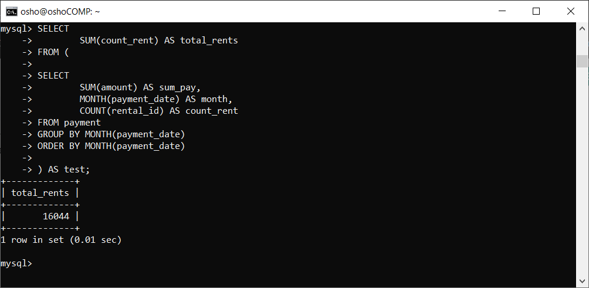
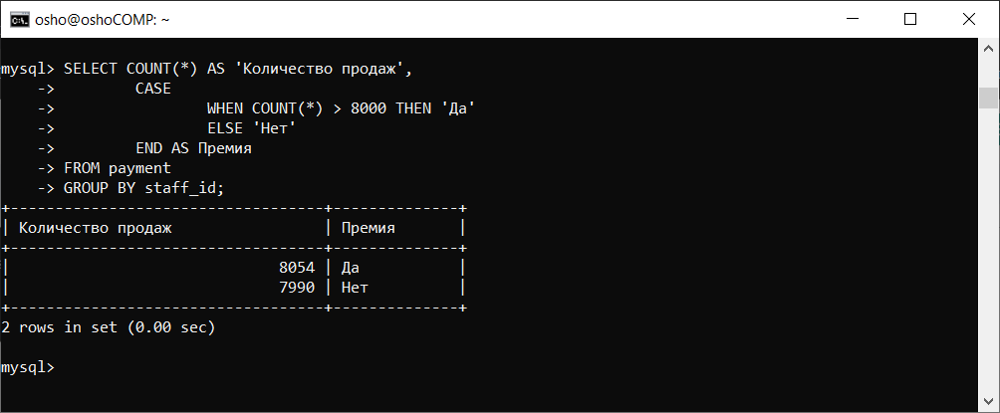
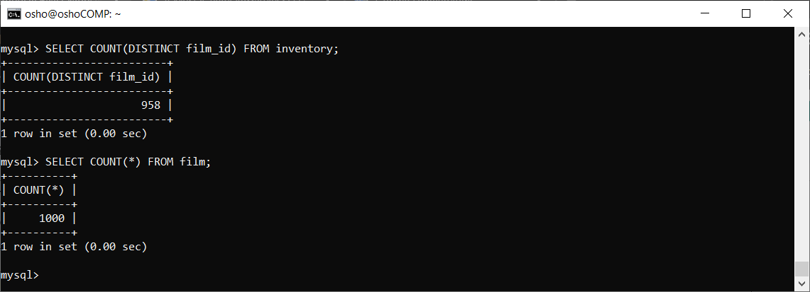

# Домашнее задание к занятию «SQL. Часть 2»

### Задание 1

Одним запросом получите информацию о магазине, в котором обслуживается более 300 покупателей, и выведите в результат следующую информацию: 
- фамилия и имя сотрудника из этого магазина;
- город нахождения магазина;
- количество пользователей, закреплённых в этом магазине.


### Решение 1



Узнать количество клиентов:

```sql
SELECT
        store_id,
        COUNT(*) AS 'количество клиентов'
FROM customer
GROUP BY store_id;
```


Данные до группировки:

```sql
SELECT
        a.address,
        CONCAT(s.first_name, ' ', s.last_name) AS manager_name,
COUNT(c.customer_id) AS total_clients
FROM store st
JOIN address a ON st.address_id = a.address_id
JOIN staff s ON st.manager_staff_id = s.staff_id
JOIN customer c ON st.store_id = c.store_id
GROUP BY st.store_id;
```


Готовый вариант:

```sql
SELECT
        a.address,
        CONCAT(s.first_name, ' ', s.last_name) AS manager_name,
COUNT(c.customer_id) AS total_clients
FROM store st
JOIN address a ON st.address_id = a.address_id
JOIN staff s ON st.manager_staff_id = s.staff_id
JOIN customer c ON st.store_id = c.store_id
GROUP BY st.store_id
HAVING total_clients > 300;
```


`HAVING` — фильтрует данные после группировки

### Задание 2

Получите количество фильмов, продолжительность которых больше средней продолжительности всех фильмов.

### Решение 2

Узнать начальные данные:

```sql
SELECT
        SUM(length) AS 'Общая продолжительность',
        COUNT(length) AS 'Количество фильмов',
        ROUND(AVG(length)) AS 'Средняя продолжительность'
FROM film;
```


Проверка вывода фильмов по продолжительности:

```sql
SELECT
        title,
        length
FROM film
WHERE length > (SELECT ROUND(AVG(length)) FROM film)
ORDER BY length;
```

Вывод команды покажет список фильмов подходящих под условие.

```
+-----------------------------+--------+
| title                       | length |
+-----------------------------+--------+
| DUCK RACER                  |    116 |
| INSTINCT AIRPORT            |    116 |
| MADIGAN DORADO              |    116 |
| WORDS HUNTER                |    116 |
| AFFAIR PREJUDICE            |    117 |

...

| MUSCLE BRIGHT               |    185 |
| POND SEATTLE                |    185 |
| SOLDIERS EVOLUTION          |    185 |
| SWEET BROTHERHOOD           |    185 |
| WORST BANGER                |    185 |
+-----------------------------+--------+
489 rows in set (0.02 sec)
```

Готовый результат подсчета строк:

```sql
SELECT
        COUNT(*) AS 'total films > AVG'
FROM film
WHERE length > (SELECT ROUND(AVG(length)) FROM film)
ORDER BY length;
```



### Задание 3

Получите информацию, за какой месяц была получена наибольшая сумма платежей, и добавьте информацию по количеству аренд за этот месяц.

### Решение 3

Узнать какие месяцы есть вообще:

```sql
SELECT MONTH(payment_date) AS month FROM payment
GROUP BY month
ORDER BY month;
```



Готовый результат:

```sql
SELECT
        SUM(amount) AS sum_pay,
        MONTH(payment_date) AS month,
        COUNT(rental_id) AS count_rent
FROM payment
GROUP BY MONTH(payment_date)
ORDER BY MONTH(payment_date);
```



`MONTH` — выводит месяц из даты

Проверка, не меняя структуры запроса:

```sql
SELECT
        SUM(count_rent) AS total_rents
FROM (


SELECT
        SUM(amount) AS sum_pay,
        MONTH(payment_date) AS month,
        COUNT(rental_id) AS count_rent
FROM payment
GROUP BY MONTH(payment_date)
ORDER BY MONTH(payment_date)


) AS test;
```



Количество рент совпадает


Чтобы убедиться, что месяцы не совпадают в разных годах применил проверку:

```sql
SELECT
EXTRACT(YEAR_MONTH FROM payment_date) AS date
FROM payment
GROUP BY date;
```

Совпадений нет:

```
+--------+
| date   |
+--------+
| 200505 |
| 200506 |
| 200507 |
| 200508 |
| 200602 |
+--------+
5 rows in set (0.01 sec)
```

### Задание 4

Посчитайте количество продаж, выполненных каждым продавцом. Добавьте вычисляемую колонку «Премия». Если количество продаж превышает 8000, то значение в колонке будет «Да», иначе должно быть значение «Нет».

### Решение 4

```sql
SELECT COUNT(*) AS 'Количество продаж',
        CASE
                WHEN COUNT(*) > 8000 THEN 'Да'
                ELSE 'Нет'
        END AS Премия
FROM payment
GROUP BY staff_id;
```



### Задание 5

Найдите фильмы, которые ни разу не брали в аренду.

### Решение 5

В *inventory* находится список фильмов взятых в аренду:



При подсчете выясняется, что фильмов в аренду взято меньше, чем общее число фильмов. Значит работать нужно с таблицей *film*.

```sql
SELECT
        f.film_id,
        f.title,
        f.release_year
FROM film f
LEFT JOIN inventory i ON i.film_id = f.film_id
LEFT JOIN rental r ON r.inventory_id = i.inventory_id
WHERE r.rental_id IS NULL;
```


Таблица *inventory* является связующем звеном между таблицей *film* и *rental*.

